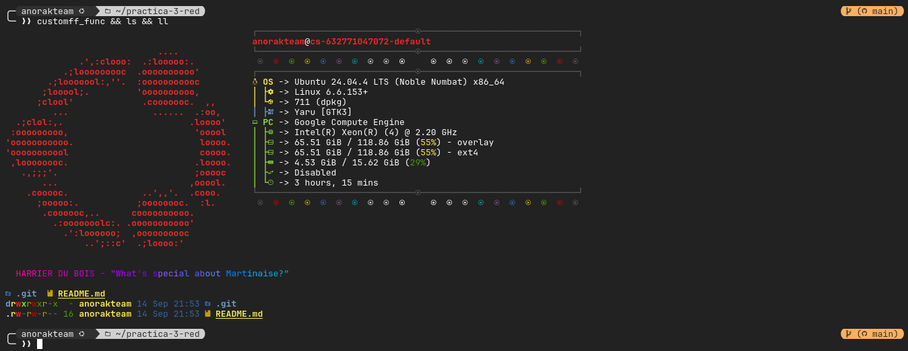
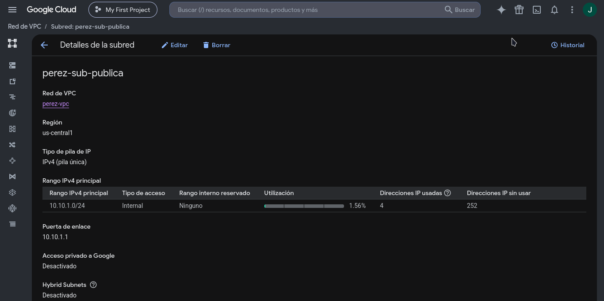
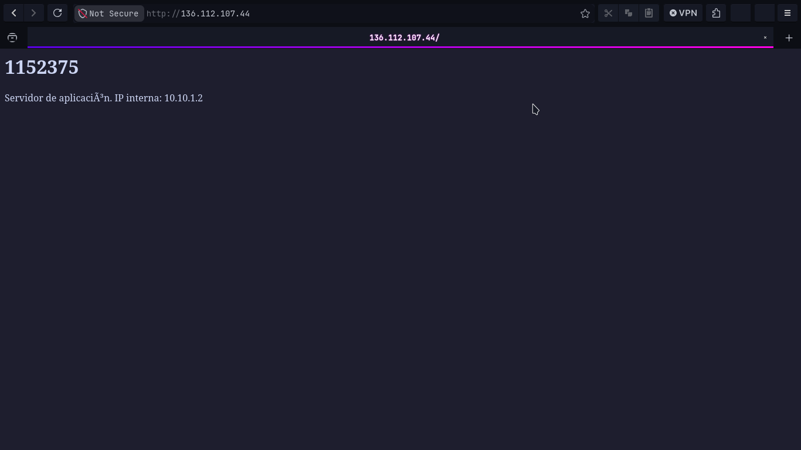
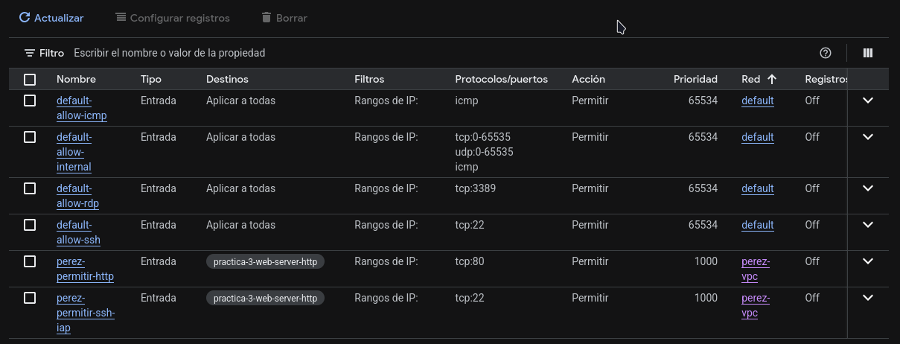

# practica-3-red

## 0: Preparación

Anteriormente, antes de la clase, había creado un repositorio (https://github.com/AnorakTeam/gcp-dotfiles) con dotfiles simplificados de mi máquina, que tienen cosas como ohmyposh, unos cuantos aliases, y otras configuraciones (no todas, una versión reducida), y aproveché a seguir la guía oficial de GCP para almacenar las cosas dentro de $HOME, algo como $HOME/bin/ y demás, y así se conservan en el disco efímero de ~5GB.

Así que el paso de instalar terraform no es necesario para mi entorno de cloud shell.



Salidas de terraform version:

```bash
╰─ ❯❯ terraform version
Terraform v1.16.2
on linux_amd64
```

y config actual de la sesión de terminal:

```bash
╰─ ❯❯ gcloud config list
[accessibility]
screen_reader = True
[component_manager]
disable_update_check = True
[compute]
gce_metadata_read_timeout_sec = 30
[core]
account = anorakteam@gmail.com
disable_usage_reporting = False
project = project-ded4209f-94f1-47b0-a63
universe_domain = googleapis.com
[metrics]
environment = devshell

Your active configuration is: [cloudshell-12772]
```

## 1: La red y su subred

Vista desde el dashboard de gcp:



Output de terraform apply:

```bash
╰─ ❯❯ terraform apply

Terraform used the selected providers to generate the following execution plan. Resource actions are indicated with the following symbols:
  + create

Terraform will perform the following actions:

  # google_compute_network.vpc will be created
  + resource "google_compute_network" "vpc" {
      + auto_create_subnetworks                   = false
      + bgp_always_compare_med                    = (known after apply)
      + bgp_best_path_selection_mode              = (known after apply)
      + bgp_inter_region_cost                     = (known after apply)
      + delete_bgp_always_compare_med             = false
      + delete_default_routes_on_create           = false
      + deletion_policy                           = "DELETE"
      + gateway_ipv4                              = (known after apply)
      + id                                        = (known after apply)
      + internal_ipv6_range                       = (known after apply)
      + mtu                                       = (known after apply)
      + name                                      = "perez-vpc"
      + network_firewall_policy_enforcement_order = "AFTER_CLASSIC_FIREWALL"
      + network_id                                = (known after apply)
      + numeric_id                                = (known after apply)
      + project                                   = "project-ded4209f-94f1-47b0-a63"
      + routing_mode                              = (known after apply)
      + self_link                                 = (known after apply)
    }

  # google_compute_subnetwork.publica will be created
  + resource "google_compute_subnetwork" "publica" {
      + allow_subnet_cidr_routes_overlap = (known after apply)
      + creation_timestamp               = (known after apply)
      + deletion_policy                  = "DELETE"
      + external_ipv6_prefix             = (known after apply)
      + fingerprint                      = (known after apply)
      + gateway_address                  = (known after apply)
      + id                               = (known after apply)
      + internal_ipv6_prefix             = (known after apply)
      + ip_cidr_range                    = "10.10.1.0/24"
      + ipv6_cidr_range                  = (known after apply)
      + ipv6_gce_endpoint                = (known after apply)
      + name                             = "perez-sub-publica"
      + network                          = (known after apply)
      + private_ip_google_access         = (known after apply)
      + private_ipv6_google_access       = (known after apply)
      + project                          = "project-ded4209f-94f1-47b0-a63"
      + purpose                          = (known after apply)
      + region                           = "us-central1"
      + self_link                        = (known after apply)
      + stack_type                       = (known after apply)
      + state                            = (known after apply)
      + subnetwork_id                    = (known after apply)

      + secondary_ip_range (known after apply)
    }

Plan: 2 to add, 0 to change, 0 to destroy.

Do you want to perform these actions?
  Terraform will perform the actions described above.
  Only 'yes' will be accepted to approve.

  Enter a value: yes

google_compute_network.vpc: Creating...
google_compute_network.vpc: Still creating... [00m10s elapsed]
google_compute_network.vpc: Creation complete after 12s [id=projects/project-ded4209f-94f1-47b0-a63/global/networks/perez-vpc]
google_compute_subnetwork.publica: Creating...
google_compute_subnetwork.publica: Still creating... [00m10s elapsed]
google_compute_subnetwork.publica: Creation complete after 11s [id=projects/project-ded4209f-94f1-47b0-a63/regions/us-central1/subnetworks/perez-sub-publica]

Apply complete! Resources: 2 added, 0 changed, 0 destroyed.
```

## 2. Variables y salidas

Salida de terraform plan:

```bash
─ ❯❯ terraform plan
google_compute_network.vpc: Refreshing state... [id=projects/project-ded4209f-94f1-47b0-a63/global/networks/perez-vpc]
google_compute_subnetwork.publica: Refreshing state... [id=projects/project-ded4209f-94f1-47b0-a63/regions/us-central1/subnetworks/perez-sub-publica]

Changes to Outputs:
  + red            = "perez-vpc"
  + subred_publica = "https://www.googleapis.com/compute/v1/projects/project-ded4209f-94f1-47b0-a63/regions/us-central1/subnetworks/perez-sub-publica"

You can apply this plan to save these new output values to the Terraform state, without changing any real infrastructure.
```

Salida de terraform apply:

```bash
╰─ ❯❯ terraform apply 
google_compute_network.vpc: Refreshing state... [id=projects/project-ded4209f-94f1-47b0-a63/global/networks/perez-vpc]
google_compute_subnetwork.publica: Refreshing state... [id=projects/project-ded4209f-94f1-47b0-a63/regions/us-central1/subnetworks/perez-sub-publica]

Changes to Outputs:
  + red            = "perez-vpc"
  + subred_publica = "https://www.googleapis.com/compute/v1/projects/project-ded4209f-94f1-47b0-a63/regions/us-central1/subnetworks/perez-sub-publica"

You can apply this plan to save these new output values to the Terraform state, without changing any real infrastructure.

Do you want to perform these actions?
  Terraform will perform the actions described above.
  Only 'yes' will be accepted to approve.

  Enter a value: yes


Apply complete! Resources: 0 added, 0 changed, 0 destroyed.

Outputs:

red = "perez-vpc"
subred_publica = "https://www.googleapis.com/compute/v1/projects/project-ded4209f-94f1-47b0-a63/regions/us-central1/subnetworks/perez-sub-publica"
```

Y terraform output

```bash
╰─ ❯❯ terraform output
red = "perez-vpc"
subred_publica = "https://www.googleapis.com/compute/v1/projects/project-ded4209f-94f1-47b0-a63/regions/us-central1/subnetworks/perez-sub-publica"
```

## 3. La aplicación

Salidas de apply y el resultado del curl:

```bash
╰─ ❯❯ terraform apply
google_compute_network.vpc: Refreshing state... [id=projects/project-ded4209f-94f1-47b0-a63/global/networks/perez-vpc]
google_compute_subnetwork.publica: Refreshing state... [id=projects/project-ded4209f-94f1-47b0-a63/regions/us-central1/subnetworks/perez-sub-publica]

Terraform used the selected providers to generate the following execution plan. Resource actions are indicated with the following symbols:
  + create

Terraform will perform the following actions:

  # google_compute_instance.app will be created
  + resource "google_compute_instance" "app" {
      + can_ip_forward          = false
      + cpu_platform            = (known after apply)
      + creation_timestamp      = (known after apply)
      + current_status          = (known after apply)
      + deletion_policy         = "DELETE"
      + deletion_protection     = false
      + effective_labels        = {
          + "goog-terraform-provisioned" = "true"
        }
      + id                      = (known after apply)
      + instance_id             = (known after apply)
      + label_fingerprint       = (known after apply)
      + machine_type            = "e2-micro"
      + metadata_fingerprint    = (known after apply)
      + metadata_startup_script = <<-EOT
            #!/bin/bash
            apt-get update -y
            apt-get install -y nginx
            INTERNA=$(curl -s -H "Metadata-Flavor: Google" \
              http://metadata.google.internal/computeMetadata/v1/instance/network-interfaces/0/ip)
            cat > /var/www/html/index.html <<HTML
            <h1>1152375</h1>
            <p>Servidor de aplicación. IP interna: $INTERNA</p>
            HTML
        EOT
      + min_cpu_platform        = (known after apply)
      + name                    = "perez-app"
      + project                 = "project-ded4209f-94f1-47b0-a63"
      + self_link               = (known after apply)
      + tags                    = [
          + "practica-3",
        ]
      + tags_fingerprint        = (known after apply)
      + terraform_labels        = {
          + "goog-terraform-provisioned" = "true"
        }
      + zone                    = "us-central1-a"

      + boot_disk {
          + auto_delete                = true
          + device_name                = (known after apply)
          + disk_encryption_key_sha256 = (known after apply)
          + guest_os_features          = (known after apply)
          + kms_key_self_link          = (known after apply)
          + mode                       = "READ_WRITE"
          + source                     = (known after apply)

          + initialize_params {
              + architecture           = (known after apply)
              + image                  = "debian-cloud/debian-12"
              + labels                 = (known after apply)
              + provisioned_iops       = (known after apply)
              + provisioned_throughput = (known after apply)
              + resource_policies      = (known after apply)
              + size                   = (known after apply)
              + snapshot               = (known after apply)
              + type                   = (known after apply)
            }
        }

      + confidential_instance_config (known after apply)

      + guest_accelerator (known after apply)

      + network_interface {
          + igmp_query                  = (known after apply)
          + internal_ipv6_prefix_length = (known after apply)
          + ipv6_access_type            = (known after apply)
          + ipv6_address                = (known after apply)
          + name                        = (known after apply)
          + network                     = (known after apply)
          + network_attachment          = (known after apply)
          + network_ip                  = (known after apply)
          + parent_nic_name             = (known after apply)
          + stack_type                  = (known after apply)
          + subnetwork                  = "projects/project-ded4209f-94f1-47b0-a63/regions/us-central1/subnetworks/perez-sub-publica"
          + subnetwork_project          = (known after apply)

          + access_config {
              + nat_ip       = (known after apply)
              + network_tier = (known after apply)
            }
        }

      + reservation_affinity (known after apply)

      + scheduling (known after apply)
    }

Plan: 1 to add, 0 to change, 0 to destroy.

Changes to Outputs:
  + ip_publica     = (known after apply)

Do you want to perform these actions?
  Terraform will perform the actions described above.
  Only 'yes' will be accepted to approve.

  Enter a value: yes

google_compute_instance.app: Creating...
google_compute_instance.app: Still creating... [00m10s elapsed]
google_compute_instance.app: Still creating... [00m20s elapsed]
google_compute_instance.app: Creation complete after 28s [id=projects/project-ded4209f-94f1-47b0-a63/zones/us-central1-a/instances/perez-app]

Apply complete! Resources: 1 added, 0 changed, 0 destroyed.

Outputs:

ip_publica = "136.112.107.44"
red = "perez-vpc"
subred_publica = "https://www.googleapis.com/compute/v1/projects/project-ded4209f-94f1-47b0-a63/regions/us-central1/subnetworks/perez-sub-publica"


╭─anorakteam   󰉖 ~/practica-3-red                                                                                                                     ( main)  ?1
╰─ ❯❯ curl -m 8 http://136.112.107.44

curl: (28) Connection timed out after 8002 milliseconds
```

## 4. Las puertas

Acceso desde el navegador:



Tabla de reglas de firewall:



Y output del proceso completo hasta el ssh a la instancia (le cambié el nombre al tag en este punto para que fuera más descriptivo, por eso el change de terraform):

```bash
╰─ ❯❯ terraform plan
google_compute_network.vpc: Refreshing state... [id=projects/project-ded4209f-94f1-47b0-a63/global/networks/perez-vpc]
google_compute_subnetwork.publica: Refreshing state... [id=projects/project-ded4209f-94f1-47b0-a63/regions/us-central1/subnetworks/perez-sub-publica]
google_compute_instance.app: Refreshing state... [id=projects/project-ded4209f-94f1-47b0-a63/zones/us-central1-a/instances/perez-app]

Terraform used the selected providers to generate the following execution plan. Resource actions are indicated with the following symbols:
  + create
  ~ update in-place

Terraform will perform the following actions:

  # google_compute_firewall.app_http will be created
  + resource "google_compute_firewall" "app_http" {
      + creation_timestamp = (known after apply)
      + deletion_policy    = "DELETE"
      + destination_ranges = (known after apply)
      + direction          = (known after apply)
      + enable_logging     = (known after apply)
      + id                 = (known after apply)
      + name               = "perez-permitir-http"
      + network            = "perez-vpc"
      + priority           = 1000
      + project            = "project-ded4209f-94f1-47b0-a63"
      + self_link          = (known after apply)
      + source_ranges      = [
          + "0.0.0.0/0",
        ]
      + target_tags        = [
          + "practica-3-web-server-http",
        ]

      + allow {
          + ports    = [
              + "80",
            ]
          + protocol = "tcp"
        }
    }

  # google_compute_firewall.ssh_iap will be created
  + resource "google_compute_firewall" "ssh_iap" {
      + creation_timestamp = (known after apply)
      + deletion_policy    = "DELETE"
      + destination_ranges = (known after apply)
      + direction          = (known after apply)
      + enable_logging     = (known after apply)
      + id                 = (known after apply)
      + name               = "perez-permitir-ssh-iap"
      + network            = "perez-vpc"
      + priority           = 1000
      + project            = "project-ded4209f-94f1-47b0-a63"
      + self_link          = (known after apply)
      + source_ranges      = [
          + "35.235.240.0/20",
        ]
      + target_tags        = [
          + "practica-3-web-server-http",
        ]

      + allow {
          + ports    = [
              + "22",
            ]
          + protocol = "tcp"
        }
    }

  # google_compute_instance.app will be updated in-place
  ~ resource "google_compute_instance" "app" {
        id                         = "projects/project-ded4209f-94f1-47b0-a63/zones/us-central1-a/instances/perez-app"
        name                       = "perez-app"
      ~ tags                       = [
          - "practica-3",
          + "practica-3-web-server-http",
        ]
        # (25 unchanged attributes hidden)

        # (4 unchanged blocks hidden)
    }

Plan: 2 to add, 1 to change, 0 to destroy.

──────────────────────────────────────────────────────────────────────────────────────────────────────────────────────────────────────────────────────────────────────────

Note: You didn't use the -out option to save this plan, so Terraform can't guarantee to take exactly these actions if you run "terraform apply" now.

╭─anorakteam   󰉖 ~/practica-3-red                                                                                                                     ( main)  ?1
╰─ ❯❯ terraform apply
google_compute_network.vpc: Refreshing state... [id=projects/project-ded4209f-94f1-47b0-a63/global/networks/perez-vpc]
google_compute_subnetwork.publica: Refreshing state... [id=projects/project-ded4209f-94f1-47b0-a63/regions/us-central1/subnetworks/perez-sub-publica]
google_compute_instance.app: Refreshing state... [id=projects/project-ded4209f-94f1-47b0-a63/zones/us-central1-a/instances/perez-app]

Terraform used the selected providers to generate the following execution plan. Resource actions are indicated with the following symbols:
  + create
  ~ update in-place

Terraform will perform the following actions:

  # google_compute_firewall.app_http will be created
  + resource "google_compute_firewall" "app_http" {
      + creation_timestamp = (known after apply)
      + deletion_policy    = "DELETE"
      + destination_ranges = (known after apply)
      + direction          = (known after apply)
      + enable_logging     = (known after apply)
      + id                 = (known after apply)
      + name               = "perez-permitir-http"
      + network            = "perez-vpc"
      + priority           = 1000
      + project            = "project-ded4209f-94f1-47b0-a63"
      + self_link          = (known after apply)
      + source_ranges      = [
          + "0.0.0.0/0",
        ]
      + target_tags        = [
          + "practica-3-web-server-http",
        ]

      + allow {
          + ports    = [
              + "80",
            ]
          + protocol = "tcp"
        }
    }

  # google_compute_firewall.ssh_iap will be created
  + resource "google_compute_firewall" "ssh_iap" {
      + creation_timestamp = (known after apply)
      + deletion_policy    = "DELETE"
      + destination_ranges = (known after apply)
      + direction          = (known after apply)
      + enable_logging     = (known after apply)
      + id                 = (known after apply)
      + name               = "perez-permitir-ssh-iap"
      + network            = "perez-vpc"
      + priority           = 1000
      + project            = "project-ded4209f-94f1-47b0-a63"
      + self_link          = (known after apply)
      + source_ranges      = [
          + "35.235.240.0/20",
        ]
      + target_tags        = [
          + "practica-3-web-server-http",
        ]

      + allow {
          + ports    = [
              + "22",
            ]
          + protocol = "tcp"
        }
    }

  # google_compute_instance.app will be updated in-place
  ~ resource "google_compute_instance" "app" {
        id                         = "projects/project-ded4209f-94f1-47b0-a63/zones/us-central1-a/instances/perez-app"
        name                       = "perez-app"
      ~ tags                       = [
          - "practica-3",
          + "practica-3-web-server-http",
        ]
        # (25 unchanged attributes hidden)

        # (4 unchanged blocks hidden)
    }

Plan: 2 to add, 1 to change, 0 to destroy.

Do you want to perform these actions?
  Terraform will perform the actions described above.
  Only 'yes' will be accepted to approve.

  Enter a value: yes

google_compute_firewall.app_http: Creating...
google_compute_firewall.ssh_iap: Creating...
google_compute_instance.app: Modifying... [id=projects/project-ded4209f-94f1-47b0-a63/zones/us-central1-a/instances/perez-app]
google_compute_firewall.app_http: Still creating... [00m10s elapsed]
google_compute_firewall.ssh_iap: Still creating... [00m10s elapsed]
google_compute_instance.app: Still modifying... [id=projects/project-ded4209f-94f1-47b0-a63/zones/us-central1-a/instances/perez-app, 00m10s elapsed]
google_compute_firewall.ssh_iap: Creation complete after 11s [id=projects/project-ded4209f-94f1-47b0-a63/global/firewalls/perez-permitir-ssh-iap]
google_compute_firewall.app_http: Creation complete after 11s [id=projects/project-ded4209f-94f1-47b0-a63/global/firewalls/perez-permitir-http]
google_compute_instance.app: Modifications complete after 11s [id=projects/project-ded4209f-94f1-47b0-a63/zones/us-central1-a/instances/perez-app]

Apply complete! Resources: 2 added, 1 changed, 0 destroyed.

Outputs:

ip_publica = "136.112.107.44"
red = "perez-vpc"
subred_publica = "https://www.googleapis.com/compute/v1/projects/project-ded4209f-94f1-47b0-a63/regions/us-central1/subnetworks/perez-sub-publica"

╭─anorakteam   󰉖 ~/practica-3-red                                                                                                                     ( main)  ?1
╰─ ❯❯ curl -m 8 http://136.112.107.44
<h1>1152375</h1>
<p>Servidor de aplicación. IP interna: 10.10.1.2</p>

╭─anorakteam   󰉖 ~/practica-3-red                                                                                                                     ( main)  ?1
╰─ ❯❯ gcloud compute ssh perez-app --tunnel-through-iap
Did you mean zone [us-east1-c] for instance: [perez-app] (Y/n)?  n

No zone specified. Using zone [us-central1-a] for instance: [perez-app].
WARNING: 

To increase the performance of the tunnel, consider installing NumPy. For instructions,
please see https://cloud.google.com/iap/docs/using-tcp-forwarding#increasing_the_tcp_upload_bandwidth

Warning: Permanently added 'compute.5680128671849749280' (ED25519) to the list of known hosts.
Linux perez-app 6.1.0-53-cloud-amd64 #1 SMP PREEMPT_DYNAMIC Debian 6.1.187-1 (2026-09-07) x86_64

The programs included with the Debian GNU/Linux system are free software;
the exact distribution terms for each program are described in the
individual files in /usr/share/doc/*/copyright.

Debian GNU/Linux comes with ABSOLUTELY NO WARRANTY, to the extent
permitted by applicable law.
anorakteam@perez-app:~$ 
```

